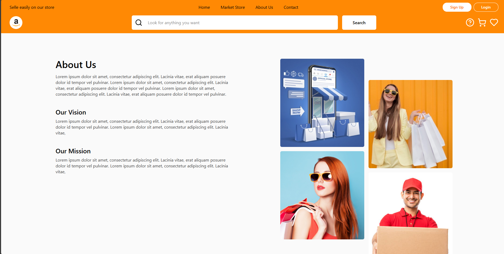

# 🛍️ E-Commerce Store (React + TypeScript + Vite)

A fully dynamic and responsive **E-Commerce Store** built using **React**, **TypeScript**, **Vite**, and **TailwindCSS** — designed with a **modern UI/UX**, seamless navigation, and rich interactive features for a smooth shopping experience.

## 🚀 Tech Stack

- **React** – UI Library  
- **TypeScript** – Type safety and scalability  
- **Vite** – Fast and modern build tool  
- **Tailwind CSS** – Utility-first styling  
- **React Router** – Routing & navigation  
- **React Helmet** – Dynamic SEO meta management

## ✨ Features

✅ **Modern & Responsive Design**  
✅ **Add / Remove Products to Cart**  
✅ **Add / Remove Products to Wishlist**  
✅ **Dynamic Product Details Page**  
✅ **Search for a product with suggests** 
✅ **Filter the Products** 
✅ **Login & Signup Authentication UI**  
✅ **Smooth Page Transitions between routes**  
✅ **Animated UI Components**  
✅ **SEO Friendly with React Helmet**  
✅ **Clean & Maintainable Codebase**  

## 📸 Preview

## 🚀 Live Demo

[🔗 View Live Store](https://react-ecommerce15.netlify.app)